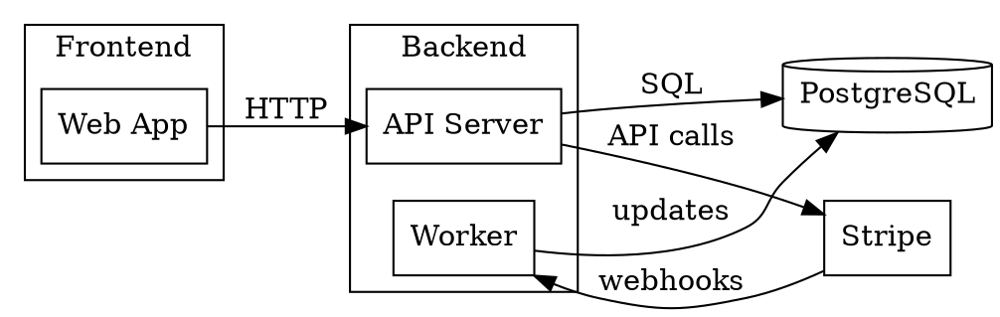
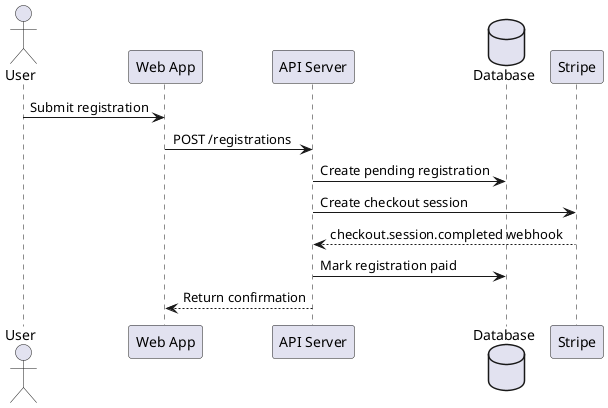
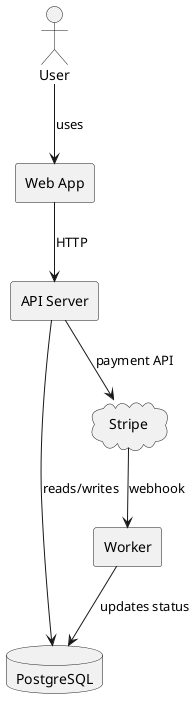

# D2 / Graphviz / PlantUML Reference

Use this reference for polished diagram-as-code, dependency graphs, and formal UML diagrams.

## D2

Use D2 when the user wants a polished diagram-as-code output that is easy to render and adjust visually.

Rendering link: https://play.d2lang.com/

### D2 system diagram template

```d2
 direction: right

 user: User
 web: Web App
 api: API Server
 db: PostgreSQL
 stripe: Stripe
 email: Email Service

 user -> web: uses
 web -> api: HTTP requests
 api -> db: reads/writes
 api -> stripe: creates checkout session
 stripe -> api: webhook events
 api -> email: sends confirmations
```

### D2 quality rules

- Keep names simple and readable.
- Label arrows.
- Use direction to improve readability.
- Prefer D2 when the output needs to look nicer than a Mermaid sketch.
- If the user wants Markdown/GitHub-native rendering, prefer Mermaid instead.

## Graphviz DOT

Use Graphviz DOT for dependency graphs, module graphs, call graphs, and structural networks.

Rendering link: https://dreampuf.github.io/GraphvizOnline/

Docs: https://graphviz.org/doc/info/lang.html

### DOT dependency graph template



### DOT quality rules

- Use clusters for packages, domains, services, or layers.
- Use `rankdir=LR` for architecture/dependency diagrams.
- Label edges with dependency type.
- DOT is better than Mermaid for dense dependency graphs.

## PlantUML

Use PlantUML for formal UML diagrams: sequence, component, class, activity, state, and use case.

Rendering links:

- https://editor.plantuml.com/
- https://www.plantuml.com/plantuml/uml/

### PlantUML sequence diagram template



### PlantUML component diagram template



### PlantUML quality rules

- Use PlantUML when the user explicitly wants UML or formal diagrams.
- Use `@startuml` and `@enduml`.
- Prefer Mermaid when the user wants quick GitHub Markdown diagrams.
- Label relationships with meaningful actions/data.
