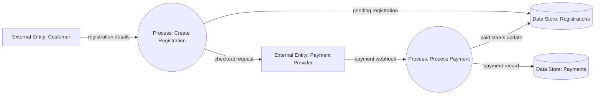

# DFD Mode Reference

Use Data Flow Diagram style when the user asks how data enters, moves through, is transformed by, is stored in, or leaves a system.

Use DFD for data movement and system scope. Use BPMN for business workflow, Mermaid sequence for time-ordered calls, DBML for schema detail, and C4 for architecture boundaries.

## Quick basics

A DFD is a data-centric model. Show what data moves and what transforms it; omit UI steps, timing, control flow, deployment detail, and implementation mechanics unless they are needed to identify a data source, process, store, or destination.

When the user needs an immediate visual preview, provide a Mermaid or D2 companion:

## Core elements

- External entities are people, organizations, or systems outside the modeled boundary. Name them as nouns, such as `Customer`, `Partner API`, or `Payment Provider`.
- Processes transform, validate, route, enrich, or calculate data. Name them as verb phrases, such as `Validate application` or `Generate invoice`.
- Data stores hold data for later use. Name them as nouns, such as `Orders`, `Customer records`, or `Audit log`.
- Data flows are labeled arrows carrying data between entities, processes, and stores. Label the data, not the action: `order details`, `payment status`, `eligibility result`.

## Levels

- Context / Level 0: show the whole system as one process, plus external entities and boundary-crossing data flows.
- Level 1: decompose the system into major processes, important data stores, external entities, and labeled data flows.
- Level 2+: decompose one complex Level 1 process at a time. Keep the child diagram balanced with the parent by preserving the same external inputs and outputs.

Do not mix levels in one diagram. If detail grows crowded, split into focused diagrams and state which parent process each diagram expands.

## Quality rules

- Every process has at least one input and one output.
- Every data store connects through a process; do not connect external entity to data store, data store to data store, or external entity to external entity directly.
- Prefer noun phrases for flows and stores, verb phrases for processes, and plain domain names for external entities.
- Label every arrow with concrete data. Avoid unlabeled arrows, vague labels like `data`, and control-flow labels like `click`, `call`, or `trigger`.
- Keep logical and physical views separate. Logical DFDs show business data movement; physical DFDs may name files, services, queues, databases, or protocols.
- Preserve known system boundaries, trust boundaries, and sensitive-data paths. Mark assumptions instead of inventing stores or flows.
- Keep each diagram readable. Duplicate an external entity for layout clarity if needed, but keep the name identical.

## Advanced features

For deeper notation choices, logical vs physical DFDs, symbol sets, levels, and
common rules, see IBM's [Data Flow Diagram reference](https://www.ibm.com/think/topics/data-flow-diagram).
