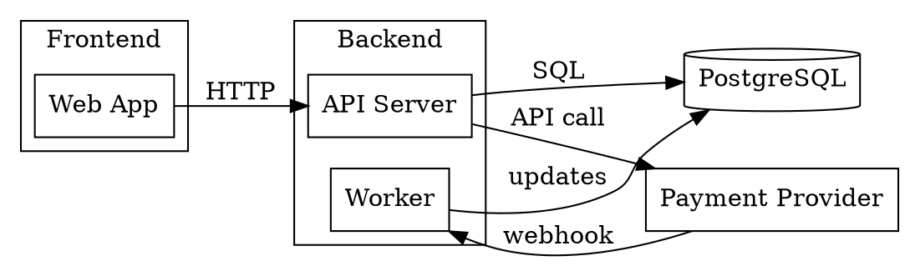
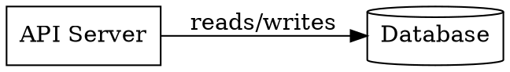

# Graphviz DOT Mode Reference

Use Graphviz DOT for dependency graphs, module graphs, call graphs, ownership maps, network topology, and structural diagrams where layout should be computed from nodes and edges.

## Mode rules

- Use DOT when the diagram is mostly relationships between entities, especially dense or cross-cutting dependencies.
- Prefer Mermaid for quick Markdown-native sketches, DBML for database schema, Structurizr/C4 for system architecture views, and PlantUML for formal UML.
- One diagram should answer one question. Split runtime flow, deployment, schema, and dependency concerns instead of crowding them together.
- Preserve real names when known. Mark gaps as `UNKNOWN`, `TODO`, or `ASSUMPTION`; do not invent components or relationships.
- Use `references/visual-preview-links.md` for the `View this visually` block.

## Quick basics

- Wrap output in a `dot` code fence.
- Use `digraph` plus `->` for directed relationships. Use `graph` plus `--` only for truly undirected maps.
- Define defaults near the top: `rankdir`, `node`, and optionally `edge`.
- Use short stable IDs and readable labels: `api [label="API Server"];`.
- Label meaningful edges with the dependency, protocol, data, event, or call type.
- Use subgraphs only for real boundaries such as packages, services, teams, domains, regions, or layers.



## Core patterns

### Digraphs, nodes, and edges



- Use directed edges for dependencies, calls, data movement, ownership, and build order.
- Keep node IDs simple and stable; put display text in `label`.
- Quote labels that contain spaces or punctuation.

### Subgraphs and clusters

```dot
subgraph cluster_payments {
  label="Payments";
  checkout [label="Checkout"];
  billing [label="Billing Worker"];
}
```

- Use `cluster_*` subgraph names when the boundary should render as a grouped box.
- Use clusters to show meaningful containment, not decoration.
- Avoid nesting clusters more than one or two levels deep.

### Rank direction and shapes

```dot
rankdir=LR;
node [shape=box];
cache [label="Redis", shape=cylinder];
queue [label="Queue", shape=component];
decision [label="Manual Review?", shape=diamond];
```

- Use `rankdir=LR` for architecture, dependency, and service graphs.
- Use `rankdir=TB` for step-by-step or hierarchical flows.
- Keep shape vocabulary small: `box` for services/modules, `cylinder` for data stores, `component` for packaged components, and `diamond` for decisions.

## Quality rules

- Keep diagrams small enough to scan; split large systems by feature, layer, package, or bounded context.
- Label edges unless the relationship is visually obvious and repeated throughout the graph.
- Make direction mean something consistent: caller to callee, owner to owned, producer to consumer, or dependency to depended-on.
- Do not mix too many edge styles, colors, shapes, or layout constraints in one diagram.
- Exclude secrets, credentials, private tokens, and sensitive sample data.
- Validate that the DOT renders before presenting it when practical.

## Advanced features

Use advanced DOT features only when they clarify the diagram. For deeper syntax, check the official Graphviz docs:

- [DOT language](https://graphviz.org/doc/info/lang.html) for grammar, IDs, attributes, subgraphs, clusters, and comments.
- [Graphviz attributes](https://graphviz.org/doc/info/attrs.html) for graph, node, and edge attributes such as `rankdir`, `label`, `style`, and constraints.
- [Graphviz shapes](https://graphviz.org/doc/info/shapes.html) for the full node shape list.
