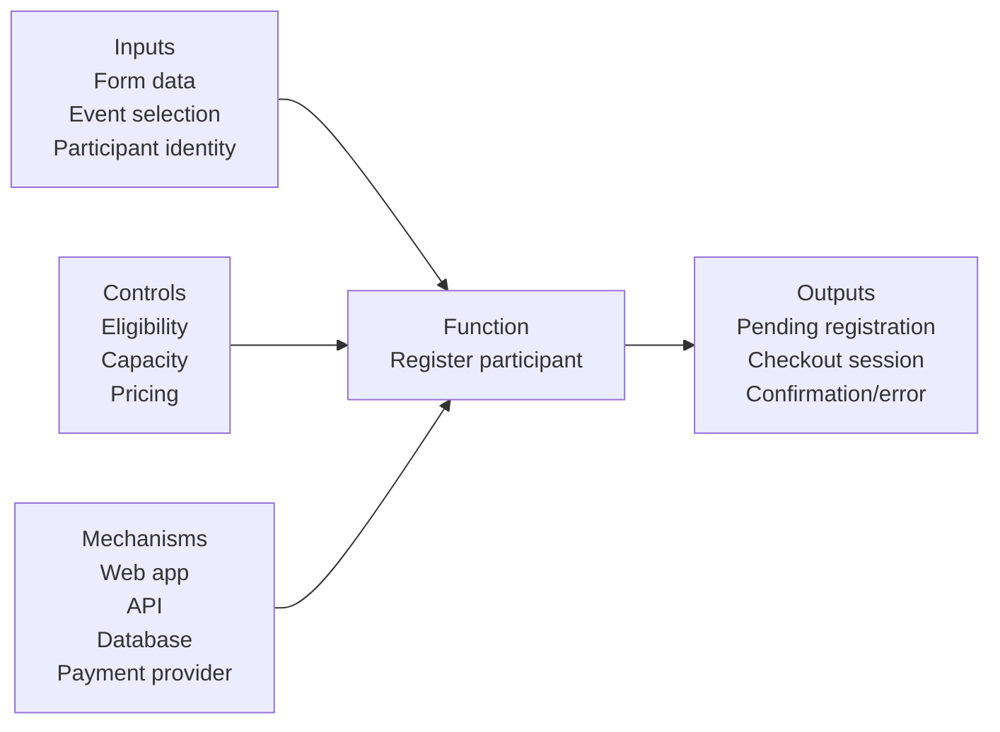
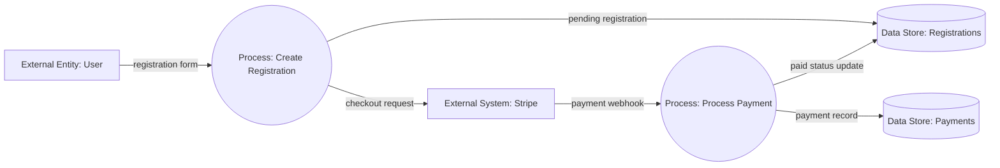

# IDEF0 / DFD / BPMN Reference

Use these notations when the user wants process clarity, data movement, inputs/outputs, controls, mechanisms, or business workflow modeling.

## IDEF0-style text model

Use IDEF0-style text when the user asks about:

- inputs and outputs
- controls
- mechanisms
- responsibilities
- transformations
- "what goes in and what comes out"

IDEF0-style output is often more useful as structured text than as code.

### IDEF0 template

```markdown
## IDEF0-style model

### Function: Register participant for event

**Inputs**
- Registration form data
- Selected event/session
- Participant identity

**Controls**
- Eligibility rules
- Capacity limits
- Pricing rules
- Payment requirements

**Outputs**
- Pending registration
- Checkout session
- Confirmation or error state

**Mechanisms**
- Web app
- API server
- Database
- Payment provider
- Email service

**Downstream**
- Payment processing
- Registration confirmation
- Attendance reporting
```

### IDEF0 visual companion

Because simple IDEF0 text does not have a universal paste-in renderer, add a Mermaid or D2 companion when the user wants immediate visual output.



## DFD-style model

Use Data Flow Diagram style when the user asks how data moves through a system.

### DFD template with Mermaid companion



Quality rules:

- External entities should be clearly named.
- Processes should be verb phrases.
- Data stores should be nouns.
- Arrows should be labeled with data names.

## BPMN-style process

Use BPMN terminology for business processes, approvals, cancellations, refunds, waitlists, and exception paths.

Use BPMN-style text by default. Produce BPMN XML only when the user explicitly asks for importable BPMN.

### BPMN-style text template

```markdown
## BPMN-style process

**Pool:** Customer registration

**Lanes**
- Customer
- Web App
- Payment Provider
- Admin/Operations

**Main path**
1. Start event: Customer chooses event/session.
2. Task: Customer submits registration form.
3. Task: System validates eligibility and capacity.
4. Gateway: Space available?
   - Yes: create pending registration.
   - No: offer waitlist or stop.
5. Task: Customer completes checkout.
6. Intermediate event: payment completed webhook received.
7. Task: System marks registration paid.
8. Task: System sends confirmation email.
9. End event: Registration confirmed.

**Exception paths**
- Payment failed -> show retry flow.
- Capacity filled before payment -> expire checkout and notify user.
- Admin cancels -> refund or credit flow.
```

### Rendering links

For BPMN XML:

- https://demo.bpmn.io/
- https://camunda.com/bpmn/tool/

For BPMN-style text without XML, include a Mermaid companion if the user needs a quick visual preview.

## Quality rules

- Use IDEF0 for input/control/output/mechanism clarity.
- Use DFD for data movement.
- Use BPMN for business process and stakeholder workflows.
- Do not produce verbose BPMN XML unless requested.
- Include exception paths for payments, cancellations, capacity, retries, and refunds when relevant.
