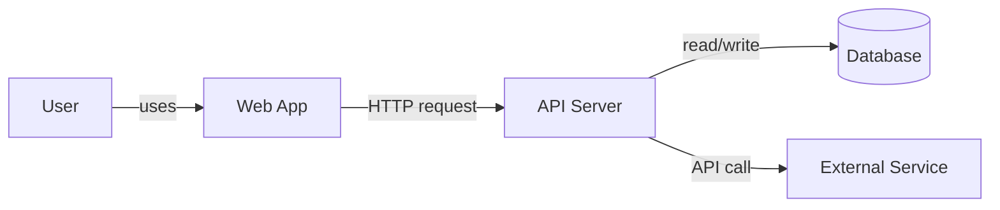
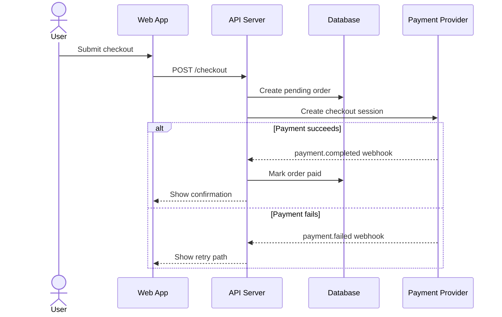
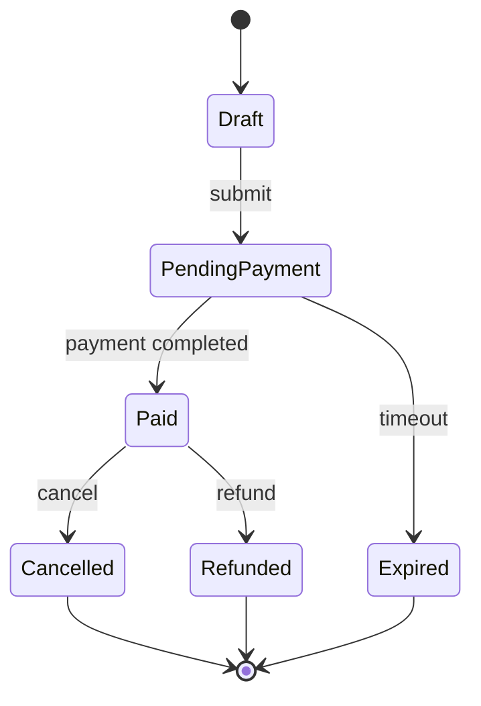
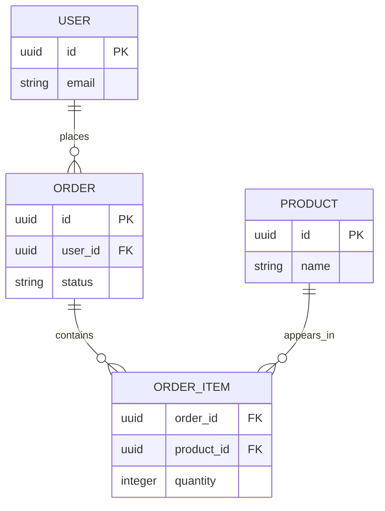
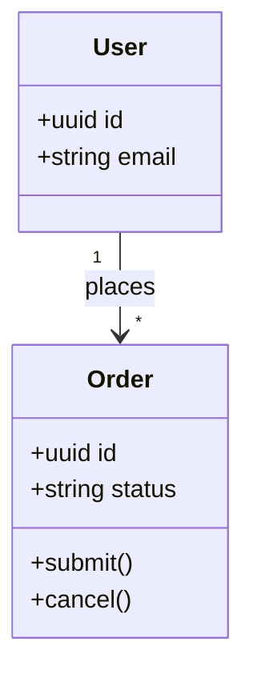

# Mermaid Reference

Use Mermaid for fast, Markdown-native diagrams that agents can paste into
GitHub docs, issue comments, and Mermaid Live.

## Mode rules

- Use Mermaid for quick architecture sketches, process/data flows, runtime
  sequences, lifecycles, simple ER diagrams, and lightweight class/domain views.
- Prefer DBML for durable database models, Structurizr/C4 for whole-system
  architecture, and OpenAPI/AsyncAPI for API or event contracts.
- One diagram should answer one question. Split runtime, schema, deployment, and
  dependency concerns instead of crowding them into one chart.
- Preserve source names when known. Mark gaps as `UNKNOWN`, `TODO`, or
  `ASSUMPTION`; do not invent services, tables, actors, or flows.
- Use `references/visual-preview-links.md` for the `View this visually` block.

## Quick basics

- Wrap output in a `mermaid` code fence.
- Start with the diagram type: `flowchart LR`, `sequenceDiagram`,
  `stateDiagram-v2`, `erDiagram`, or `classDiagram`.
- Use short stable IDs and readable labels: `api[API Server]`, `db[(Database)]`.
- Label system arrows with the data, event, call, or responsibility crossing the
  boundary.
- Use subgraphs only for real boundaries such as apps, services, domains, or
  layers.
- Keep syntax plain unless an advanced feature clearly improves comprehension.

## Common diagram types

| Need | Use |
|---|---|
| App/service overview, process, data movement | `flowchart LR` or `flowchart TD` |
| Runtime interaction over time | `sequenceDiagram` |
| Status/lifecycle transitions | `stateDiagram-v2` |
| Quick schema sketch | `erDiagram` |
| Lightweight domain or class relationships | `classDiagram` |

### Flowchart

Use for high-level system, process, or data-flow diagrams. Prefer `LR` for
architecture and `TD` for step-by-step processes.

### Sequence diagram

Use for request paths, webhooks, async events, and cross-service conversations.
Use `alt` / `else` when failure paths matter.

### State diagram

Use for lifecycles, statuses, and valid transitions.

### ER diagram

Use for a quick Markdown-rendered schema sketch. Use DBML instead when the user
needs reusable schema documentation.

### Class / domain diagram

Use sparingly for domain objects, code-level classes, or ownership
relationships.

## Quality rules

- Keep diagrams small enough to scan. Split large systems into focused views.
- Label every meaningful relationship. Unlabeled arrows usually signal unclear
  scope or missing context.
- Show error, timeout, cancellation, and retry paths when they affect the
  user's understanding.
- Use humans as `actor` in sequence diagrams; use participants for systems.
- Use `[(Database)]` or explicit data-store labels for persisted state.
- Do not mix logical, runtime, deployment, and database views unless the user
  explicitly wants a rough all-in-one sketch.
- Exclude secrets, tokens, private credentials, and sensitive user data.
- Validate that the diagram renders before presenting it when practical.

## Advanced Features

Use advanced Mermaid features only when they clarify the diagram. For deeper
syntax, check the official docs:

- [Mermaid syntax reference](https://mermaid.js.org/intro/syntax-reference.html)
- [Flowcharts](https://mermaid.js.org/syntax/flowchart.html)
- [Sequence diagrams](https://mermaid.js.org/syntax/sequenceDiagram.html)
- [State diagrams](https://mermaid.js.org/syntax/stateDiagram.html)
- [Entity relationship diagrams](https://mermaid.js.org/syntax/entityRelationshipDiagram.html)
- [Class diagrams](https://mermaid.js.org/syntax/classDiagram.html)
- [Configuration](https://mermaid.js.org/config/configuration.html)
- [Themes](https://mermaid.js.org/config/theming.html)
