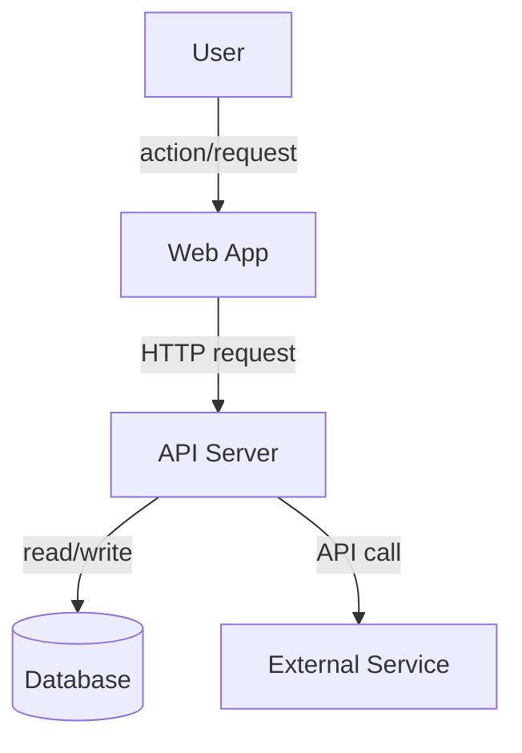
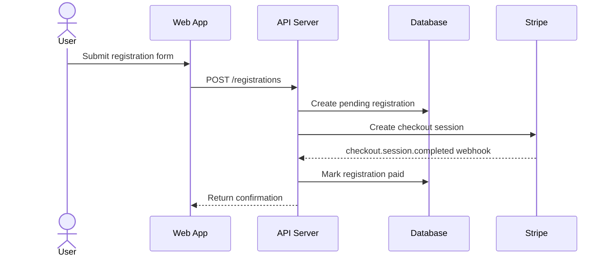
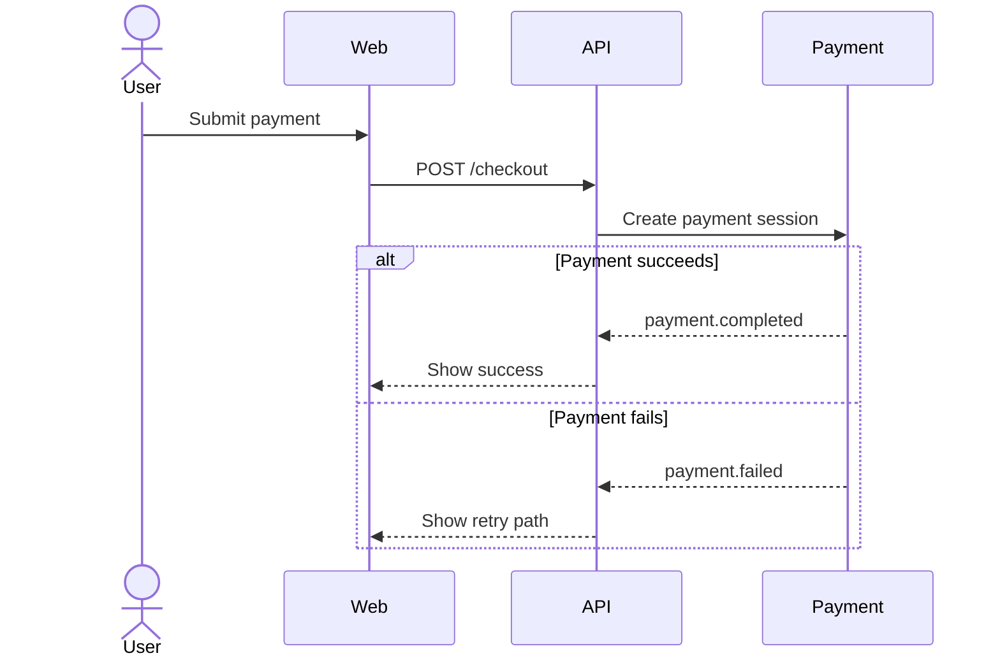
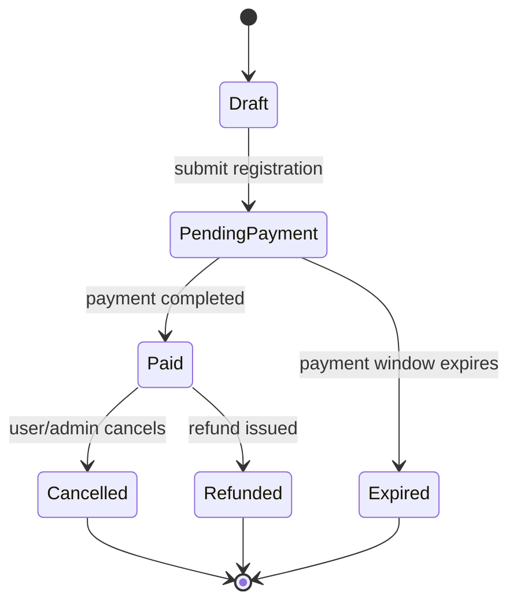
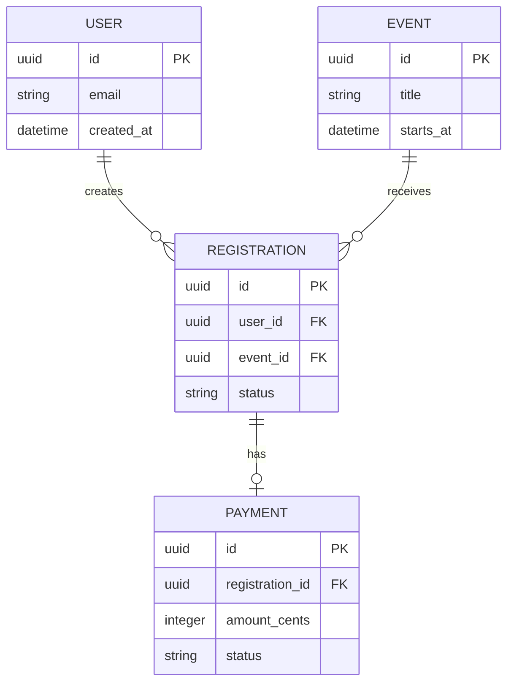
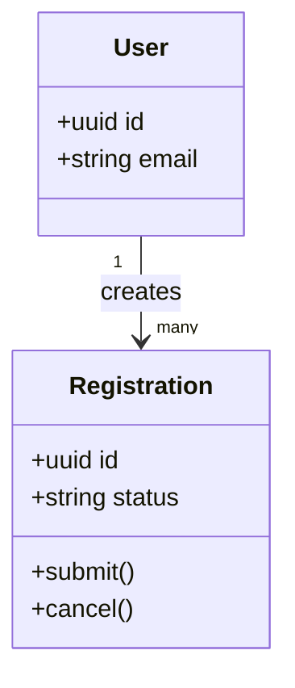

# Mermaid Reference

Use Mermaid when the user wants diagrams that are readable in Markdown, easy to paste into GitHub docs, and quick to preview visually.

## When to use Mermaid

Use Mermaid for:

- quick system overview diagrams
- runtime sequence diagrams
- state lifecycle diagrams
- simple ER diagrams
- simple class/domain diagrams
- repo documentation that GitHub can render

## Rendering links

Use `references/visual-preview-links.md` for the `View this visually` block.

Default link: https://mermaid.live

## Flowchart template

Use for high-level app, service, or data flow.

Quality rules:

- Use `flowchart TD` or `flowchart LR`.
- Prefer `LR` for left-to-right architecture diagrams.
- Prefer `TD` for process flows.
- Label arrows with what moves across the boundary.
- Use database cylinder syntax `[(Database)]` for data stores.
- Use subgraphs for domains/layers when helpful.
- Do not create a huge hairball. Split large diagrams.

## Sequence diagram template

Use for runtime interactions over time.

Quality rules:

- Use actor for humans.
- Use participants for systems/services.
- Use `->>` for calls and `-->>` for async returns/events.
- Include key failure branches with `alt` / `else` when relevant.

Failure branch example:

## State diagram template

Use for lifecycle/status transitions.

Quality rules:

- Include terminal states.
- Include failure/timeout/cancellation states when relevant.
- Label transitions with trigger events.

## ER diagram template

Use for simple schema diagrams when the user wants Markdown-native output.

Quality rules:

- Use DBML instead when the user wants a reusable database modeling language.
- Use Mermaid ER when the user wants quick GitHub/Markdown rendering.
- Mark uncertain cardinality with notes outside the diagram.

## Class/domain diagram template

Use sparingly for domain objects or code-level classes.

## Common mistakes

Avoid:

- unlabeled arrows in system diagrams
- too many nodes in one diagram
- mixing deployment, runtime, and database concerns in one crowded chart
- inventing services or tables not present in source material
- using Mermaid ER as a replacement for detailed database documentation when DBML is a better fit
