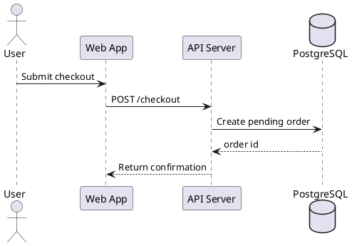
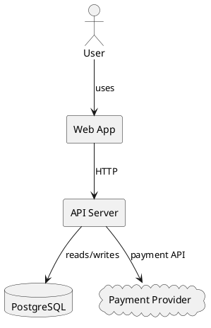
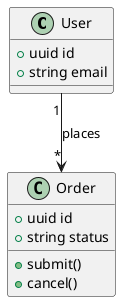
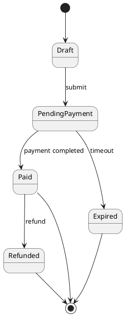
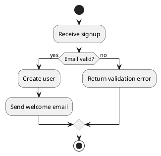

# PlantUML Reference

Use PlantUML for formal UML diagrams: sequence, component, class, state,
activity, use case, and deployment views.

## Mode rules

- Use PlantUML when the user explicitly wants UML, formal notation, or a
  diagram type PlantUML handles better than Markdown-native Mermaid.
- Prefer Mermaid for quick GitHub-rendered sketches, Structurizr/C4 for durable
  architecture documentation, and Graphviz DOT for dense dependency graphs.
- One diagram should answer one question. Split runtime interaction, component
  structure, class/domain shape, lifecycle, and workflow into separate diagrams.
- Preserve real names from the codebase. Mark gaps as `UNKNOWN`, `TODO`, or
  `ASSUMPTION`; do not invent systems, classes, actors, states, or flows.

## Quick basics

- Wrap output in a `plantuml` code fence.
- Every diagram starts with `@startuml` and ends with `@enduml`.
- Declare important elements before relationships so aliases, ordering, and
  shapes stay stable.
- Use aliases for readable edges: `component "API Server" as API`.
- Label relationships with the action, dependency, data, event, or transition.
- Keep labels short. Use quoted labels for spaces and `\n` only when needed.

## Core patterns

### Participants and sequences

Use sequence diagrams for runtime conversations, request paths, async events,
and webhook flows. Use `actor` for humans and `participant`, `database`,
`queue`, or `boundary` for systems with meaningful roles.

### Components

Use component diagrams for services, modules, packages, adapters, and external
systems. Label edges with protocols or responsibilities.

### Classes

Use class diagrams for domain models, code-level structure, ownership, and
inheritance. Include only fields and methods that explain the relationship.

### States

Use state diagrams for lifecycle rules, valid status changes, and terminal
states. Name transitions with the event or condition that causes the move.

### Activities

Use activity diagrams for workflows, decisions, loops, and operational steps.
Prefer simple action text and explicit branches.

## Quality rules

- Choose the diagram type before writing syntax; do not mix class, state,
  runtime, and deployment concerns in one diagram.
- Keep diagrams small enough to scan. Split views before adding visual clutter.
- Label every meaningful edge or transition. Unlabeled arrows usually mean the
  relationship is underspecified.
- Show error, retry, cancellation, timeout, and terminal paths when they matter.
- Use consistent aliases and names across companion diagrams.
- Avoid decorative styling unless it clarifies grouping, boundaries, or risk.
- Exclude secrets, credentials, tokens, and sensitive user data.
- Validate that the PlantUML renders before presenting it when practical.

## Advanced features

Use advanced PlantUML features only when they improve comprehension. For deeper
syntax, use the official docs:

- [Sequence diagrams](https://plantuml.com/sequence-diagram)
- [Component diagrams](https://plantuml.com/component-diagram)
- [Class diagrams](https://plantuml.com/class-diagram)
- [State diagrams](https://plantuml.com/state-diagram)
- [Activity diagrams](https://plantuml.com/activity-diagram-beta)
- [Use case diagrams](https://plantuml.com/use-case-diagram)
- [Deployment diagrams](https://plantuml.com/deployment-diagram)
- [Common commands and styling](https://plantuml.com/commons)
